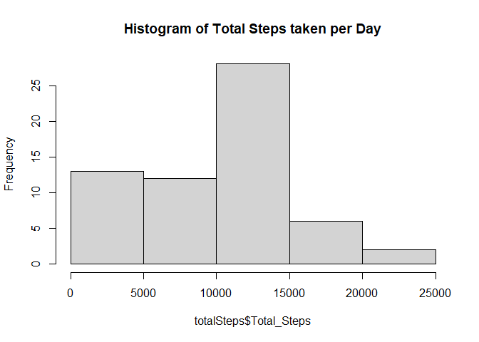
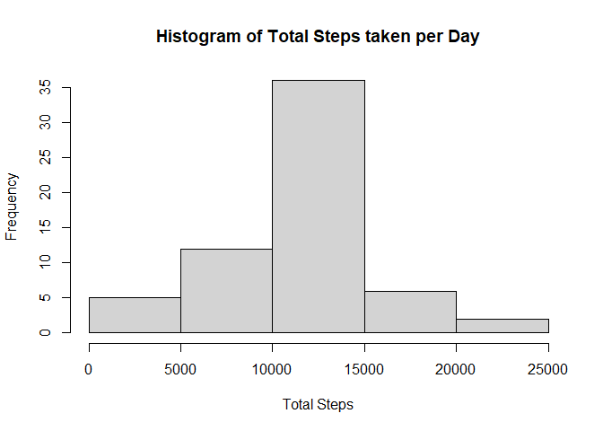
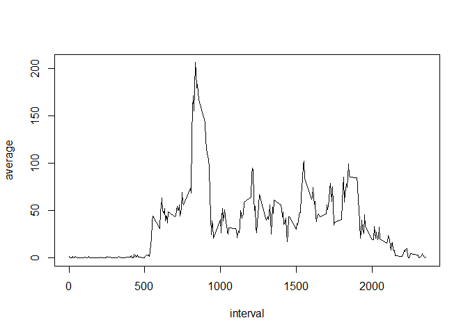
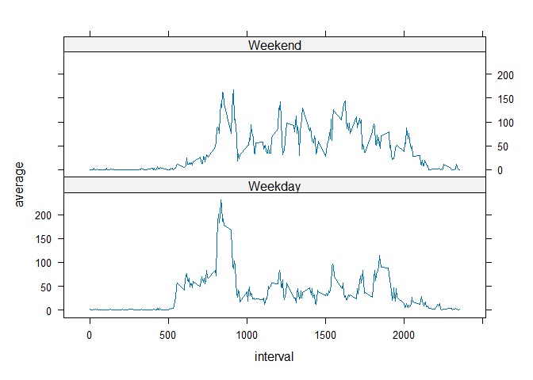

## Loading and preprocessing the data

```r
data <- read.csv("activity.csv")
data$date <- as.Date(data$date)
```


## What is mean total number of steps taken per day?


```r
library(tidyr)
totalSteps <- aggregate(list(Total_Steps = data$steps), list(Date = data$date), sum, na.rm = T)
hist(totalSteps$Total_Steps, main = paste("Histogram of" , "Total Steps taken per Day"),)
```

<!-- -->

```r
mean(totalSteps$Total_Steps)
```

```
## [1] 9354.23
```

```r
median(totalSteps$Total_Steps)
```

```
## [1] 10395
```

## What is the average daily activity pattern?

On average people seem to have average no. of steps in the interval between 500 -1000

```r
avgStep = aggregate(list( average = data$steps), list(interval =data$interval), mean, na.rm = T)
plot(x = avgStep$interval, y = avgStep$average,type = "l", ylab = "average", xlab = "interval")
```

<!-- -->


## Imputing missing values
putting average steps in that interval

```r
totaNA <- sum(!complete.cases(data))
redo <- function(interval, index){
  data$steps[index] <<- round(avgStep[which(avgStep$interval == interval),]$average)
}
for(x in 1:nrow(data)){
  if(!complete.cases(data[x,])){
    redo(data$interval[x], x)
  }
}
```
The histogram seems to change a lot as the average of each interval was used to replace the missing value, since the mean was seen to belong in the 1000 -1500 steps per day so after replacing the missing values frequency of taking 1000-1500 steps per day increased.


```r
totalSteps <- aggregate(list(Total_Steps = data$steps), list(Date = data$date), sum, na.rm = T)
hist(totalSteps$Total_Steps, main = "Histogram of Total Steps taken per Day", xlab = "Total Steps")
```

<!-- -->

```r
mean(totalSteps$Total_Steps)
```

```
## [1] 10765.64
```

```r
median(totalSteps$Total_Steps)
```

```
## [1] 10762
```

Whereas time series plot doesn't seem to change drastically, as the values were used to fill the missing value of the steps for that interval, so the histogram seems unchanged.

```r
avgStep = aggregate(list( average = data$steps), list(interval =data$interval), mean, na.rm = T)
plot(x = avgStep$interval, y = avgStep$average,type = "l", ylab = "average", xlab = "interval")
```

<!-- -->


## Are there differences in activity patterns between weekdays and weekends?
Average steps is more uniform throughout the day during the weekends, but during weekdays there seems to be a huge spike in  steps in the first half of the day.

```r
Day = c()
for(x in 1:nrow(data)){
  if(weekdays(data[x, ]$date) %in% c("Monday", "Tuesday","Wednesday","Thursday", "Friday")){
   Day <- append(Day, "Weekday") 
  }else{
   Day <- append(Day, "Weekend") 
  }
}
data <- cbind(data,Day)
avgStepW = aggregate(list( average = data$steps), list(interval =data$interval, Day = data$Day), mean)
library(lattice)
xyplot(average ~ interval   | Day, data = avgStepW, layout = c(1, 2),type = "l")
```

<!-- -->
